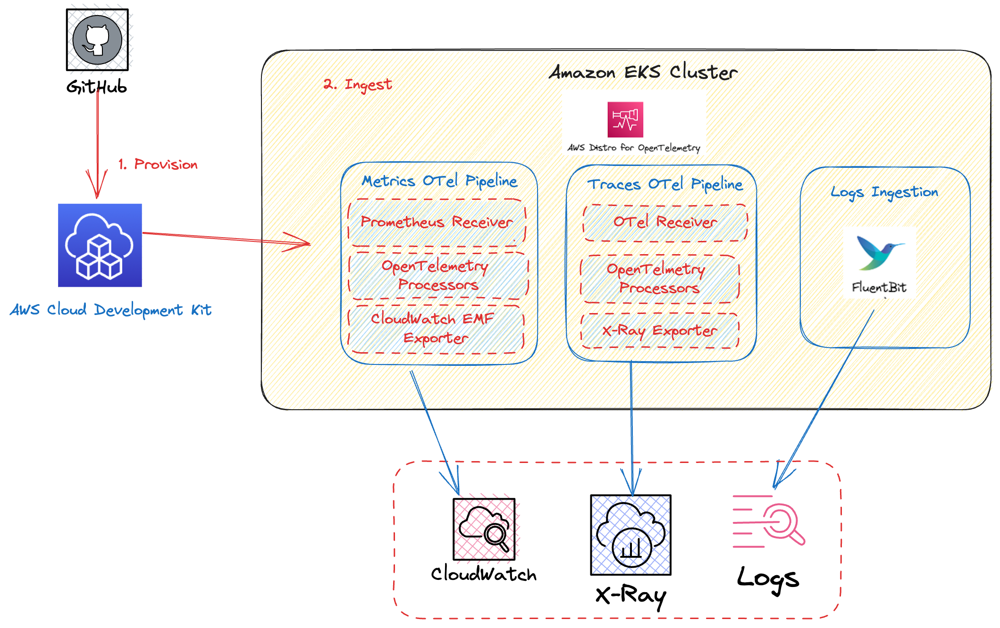

# Existing EKS Cluster AWS Mixed Observability Accelerator

## Architecture

The following figure illustrates the architecture of the pattern we will be deploying for Existing EKS Cluster AWS Mixed Observability pattern, using AWS native tools such as CloudWatch and X-Ray and Open Source tools such as Amazon Distro for OpenTelmetry (ADOT) and Prometheus Node Exporter.



This example makes use of CloudWatch, as a metric and log aggregation layer, while X-Ray is used as a trace-aggregation layer. In order to collect the metrics and traces, we use the Open Source ADOT collector. Fluent Bit is used to export the logs to CloudWatch Logs.

In this architecture, AWS X-Ray provides a complete view of requests as they travel through your application and filters visual data across payloads, functions, traces, services, and APIs. X-Ray also allows you to perform analytics, to gain powerful insights about your distributed trace data.

Utilizing CloudWatch and X-Ray as an aggregation layer allows for a fully-managed scalable telemetry backend. In this example we get those benefits while still having the flexibility and rapid development of the Open Source collection tools.

## Objective

This pattern aims to add Observability on top of an existing EKS cluster, with a mixture of AWS native and open source managed AWS services.

## Prerequisites:

Ensure that you have installed the following tools on your machine:

1. [aws cli](https://docs.aws.amazon.com/cli/latest/userguide/install-cliv2.html)
2. [kubectl](https://Kubernetes.io/docs/tasks/tools/)
3. [cdk](https://docs.aws.amazon.com/cdk/v2/guide/getting_started.html#getting_started_install)
4. [npm](https://docs.npmjs.com/cli/v8/commands/npm-install)

You will also need:

1. Either an existing EKS cluster, or you can setup a new one with  [Single New EKS Cluster Observability Accelerator](./single-new-eks-cluster.md)
2. An OpenID Connect (OIDC) provider, associated to the above EKS cluster (Note: Single EKS Cluster Pattern takes care of that for you)

## Deploying

1. Edit `~/.cdk.json` by setting the name of your existing cluster:

```json
    "context": {
        ...
        "existing.cluster.name": "...",
        ...
    }
```

2. Edit `~/.cdk.json` by setting the kubectl role name; if you used Single New EKS Cluster Observability Accelerator to setup your cluster, the kubectl role name would be provided by the output of the deployment, on your command-line interface (CLI):

```json
    "context": {
        ...
        "existing.kubectl.rolename":"...",
        ...
    }
```

3. Run the following command from the root of this repository to deploy the pipeline stack:

```bash
make build
make pattern existing-eks-mixed-observability deploy
```

## Verify the resources

Please see [Single New EKS Cluster AWS Mixed Observability Accelerator](./single-new-eks-mixed-observability.md).

## Teardown

You can teardown the whole CDK stack with the following command:

```bash
make pattern existing-eks-mixed-observability destroy
```

If you setup your cluster with Single New EKS Cluster Observability Accelerator, you also need to run:

```bash
make pattern single-new-eks-cluster destroy
```
