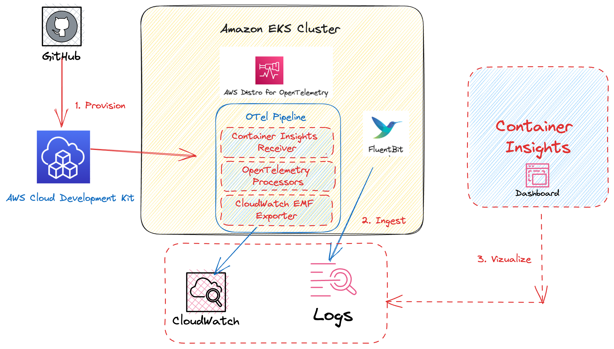
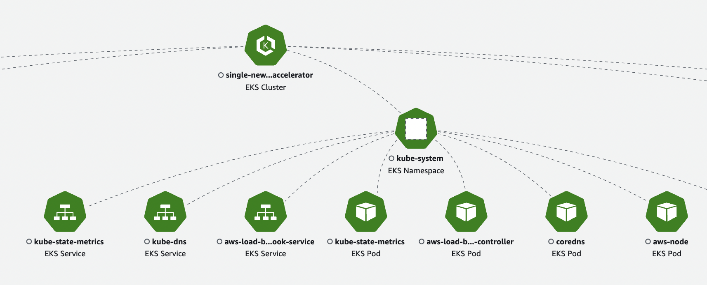
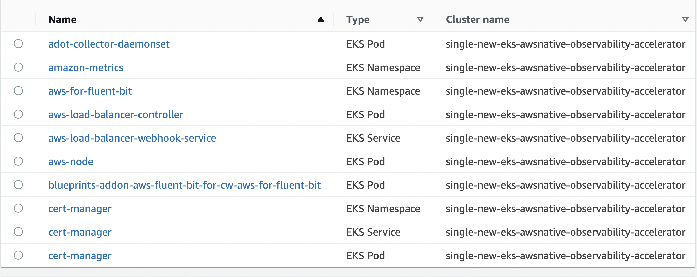
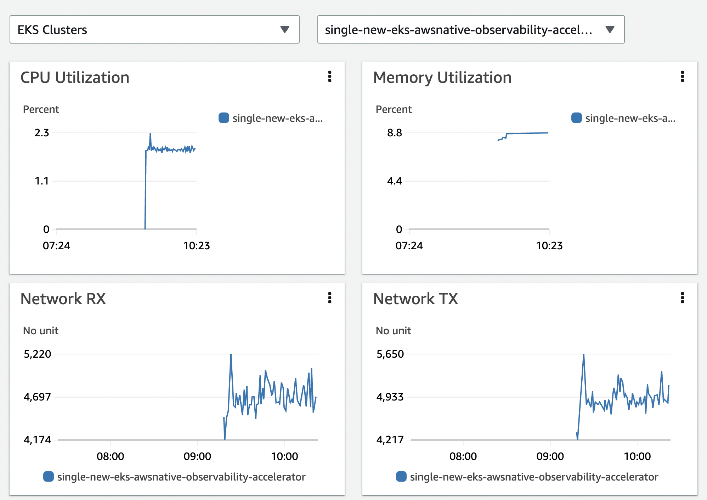

# Single New EKS Cluster AWS Native Observability Accelerator

## Architecture

The following figure illustrates the architecture of the pattern we will be deploying for Single EKS Cluster Native Observability pattern using AWS native tools such as CloudWatch Logs and Container Insights.



This example makes use of CloudWatch Container Insights as a vizualization and metric-aggregation layer.
Amazon CloudWatch Container Insights helps customers collect, aggregate, and summarize metrics and logs from containerized applications and microservices. Metrics data is collected as performance log events using the embedded metric format. These performance log events use a structured JSON schema that enables high-cardinality data to be ingested and stored at scale. From this data, CloudWatch creates aggregated metrics at the cluster, node, pod, task, and service level as CloudWatch metrics. The metrics that Container Insights collects are available in CloudWatch automatic dashboards.

By combining Container Insights and CloudWatch logs, we are able to provide a foundation for EKS (Amazon Elastic Kubernetes Service) Observability. Monitoring EKS for metrics has two categories:
the control plane and the Amazon EKS nodes (with Kubernetes objects).
The Amazon EKS control plane consists of control plane nodes that run the Kubernetes software,
such as etcd and the Kubernetes API server. To read more on the components of an Amazon EKS cluster,
please read the [service documentation](https://docs.aws.amazon.com/eks/latest/userguide/clusters.html).

## Objective

- Deploys one production grade Amazon EKS cluster.
- AWS Distro For OpenTelemetry Operator and Collector
- Logs with [AWS for FluentBit](https://github.com/aws/aws-for-fluent-bit) and CloudWatch Logs
- Enables CloudWatch Container Insights.
- Installs Prometheus Node Exporter for infrastructure metrics.

## Prerequisites:

Ensure that you have installed the following tools on your machine.

1. [aws cli](https://docs.aws.amazon.com/cli/latest/userguide/install-cliv2.html)
2. [kubectl](https://Kubernetes.io/docs/tasks/tools/)
3. [cdk](https://docs.aws.amazon.com/cdk/v2/guide/getting_started.html#getting_started_install)
4. [npm](https://docs.npmjs.com/cli/v8/commands/npm-install)

## Deploying

1. Clone your forked repository

```sh
git clone https://github.com/aws-observability/cdk-aws-observability-accelerator.git
```

2. Install the AWS CDK Toolkit globally on your machine using

```bash
npm install -g aws-cdk
```

3. Install project dependencies by running `npm install` in the main folder of this cloned repository

4. Once all pre-requisites are set you are ready to deploy the pipeline. Run the following command from the root of this repository to deploy the pipeline stack:

```bash
make build
make pattern single-new-eks-awsnative-observability deploy
```

## Verify the resources

Run update-kubeconfig command. You should be able to get the command from CDK output message.

```bash
aws eks update-kubeconfig --name single-new-eks-awsnative-observability-accelerator --region <your region> --role-arn arn:aws:iam::xxxxxxxxx:role/single-new-eks-awsnative-singleneweksawsnativeobs-JN3QM2KMBNCO
```

Let’s verify the resources created by steps above.

```bash
kubectl get nodes -o wide
```
Output:

```console
NAME                                         STATUS   ROLES    AGE    VERSION               INTERNAL-IP    EXTERNAL-IP   OS-IMAGE         KERNEL-VERSION                  CONTAINER-RUNTIME
ip-10-0-104-200.us-west-2.compute.internal   Ready    <none>   2d1h   v1.25.9-eks-0a21954   10.0.104.200   <none>        Amazon Linux 2   5.10.179-168.710.amzn2.x86_64   containerd://1.6.19
```

Next, lets verify the namespaces in the cluster:

```bash
kubectl get ns # Output shows all namespace
```

Output:

```console
NAME                       STATUS   AGE
amazon-metrics             Active   10m
aws-for-fluent-bit         Active   10m
cert-manager               Active   10m
default                    Active   16m
kube-node-lease            Active   16m
kube-public                Active   16m
kube-system                Active   16m
prometheus-node-exporter   Active   10m
```

## Visualization

Navigate to CloudWatch and go to "Container Insights".

View the Container Map:



View the Resource List:



View the Performance Monitoring Dashboard:



## Viewing Logs

Please see [Logging](../../logs.md) for information on viewing Logs.


## Teardown

You can teardown the whole CDK stack with the following command:

```bash
make pattern single-new-eks-awsnative-observability destroy
```